# Gemini Floating Assistant & Nothing OS Island Suite
### Enterprise Desktop Customization Suite for KDE Plasma 6 (Wayland)

[](https://kde.org/plasma-desktop/)
[]()
[]()
[]()

A production-grade, modular Linux desktop enhancement suite that bridges the mobile Android Gemini assistant floating overlay experience with the refined aesthetic of the Nothing OS Dynamic Island topbar, system-wide notifications, and an immersive native wallpaper desktop widget canvas on KDE Plasma 6 Wayland.

---

## Architecture Overview

The suite coordinates seven modular subsystems across user space, compositor D-Bus APIs, systemd user services, native Plasma wallpaper engines, and browser extensions to achieve a complete Nothing OS desktop experience.

### Mermaid Architecture Diagram

```mermaid
graph TD
    subgraph "KDE Plasma 6 Shell & Desktop"
        TopBar["Nothing OS Island Plasmoid<br/>(org.omar.nothingisland)"]
        Wallpaper["Nothing OS Desktop Wallpaper<br/>(org.omar.nothingdesktop)"]
        KWin["KWin 6 Compositor<br/>(Wayland Scripting & Rules)"]
        Shortcuts["KDE Global Shortcuts<br/>(HP Omen Launch(2) / Meta+Space)"]
        NotifDaemon["Nothing Notification Daemon<br/>(daemon/notifications/server.py)"]
    end

    subgraph "Wallpaper & Desktop Widget Layer"
        GlyphBorder["Glyph Ambient Border Light<br/>(Charging Pulse / Notification Flash / Pomodoro Red)"]
        NowCard["Unified 'Now' Card (Contextual)<br/>(Pomodoro > Media > Next Event > Hidden)"]
        CenterClock["Dot-Matrix Clock & Date<br/>(Dot-Dissolve Minute Tick & Day-Progress Hairline)"]
        PersistentWidgets["Persistent Widgets<br/>(System Vitals, Quick Notes, Quick Toggles, Month Calendar)"]
        FocusToggle["One-Click Focus Mode<br/>(Dims Background & Silences Non-Critical Notifications)"]
        DotEngine["Dot-Dissolve Transition Engine<br/>(Reusable Matrix Scatter/Assemble Component)"]
    end

    subgraph "Daemon Microservices (Localhost:8765)"
        Daemon["daemon/server.py<br/>(Python Microservice)"]
        Systemd["systemd/user<br/>(gemini-screenshot.service)"]
        ActiveState["/tmp/gemini_active<br/>(IPC State Flag)"]
    end

    subgraph "Floating Assistant Window"
        Toggle["bin/gemini-toggle.sh<br/>(Launcher & Window Toggle)"]
        Brave["Brave / Chromium WebApp<br/>(https://gemini.google.com/app)"]
        Ext["Brave Extension MV3<br/>(content.js & style.css)"]
    end

    subgraph "System Capture Engine"
        Spectacle["KDE Spectacle<br/>(Desktop Screenshot Utility)"]
    end

    %% Interactions
    Shortcuts -->|Invokes| Toggle
    TopBar -->|Pill Click| Toggle
    TopBar -->|Polls HTTP :8765/active| Daemon
    Daemon -->|Reads/Writes| ActiveState
    Toggle -->|Toggles Window State| KWin
    Toggle -->|Launches with App Profile| Brave
    Ext -->|Injects UI Controls| Brave
    Ext -->|POST /screenshot| Daemon
    Ext -->|POST /active?val=1| Daemon
    Ext -->|POST /close| Daemon
    Ext -->|POST /maximize| Daemon
    Daemon -->|Minimizes Gemini Window| KWin
    Daemon -->|Executes background capture| Spectacle
    Daemon -->|Restores Gemini Window| KWin
    Spectacle -->|Returns Image Bytes| Daemon
    Daemon -->|Streams PNG Image| Ext

    %% Wallpaper Widget Connections
    Wallpaper --> GlyphBorder
    Wallpaper --> CenterClock
    Wallpaper --> NowCard
    Wallpaper --> PersistentWidgets
    PersistentWidgets --> FocusToggle
    NowCard --> DotEngine
    CenterClock --> DotEngine
    NowCard -->|D-Bus MPRIS Raise| KWin
```



### Desktop Screen Real Estate Layout

```
+---------------------------------------------------------------------------------------------------+
|                                     NOTHING OS DYNAMIC ISLAND                                     |
|  [ Weather ] [ Status ]               [ Island / MiniPlayer ]               [ Net / Bat / Bell ]  |
+---------------------------------------------------------------------------------------------------+
|                                                                                                   |
|  [ LEFT COLUMN ]                       [ CENTER COLUMN ]                     [ RIGHT COLUMN ]     |
|  * Today Weather Chip                  * Dot-Matrix Clock & Date             * System Vitals      |
|    - Compact 38px temperature            - Day-progress hairline               - CPU/RAM 60s live |
|    - Condition & wttr.in refresh       * AI Launcher Pills                   * Focus Pomodoro     |
|  * Quick Toggles                         - Claude & Gemini quick pills         - Compact 44px ring|
|    - Wi-Fi, BT, DND, Night Light                                             * Quick Notes        |
|  * Month Calendar View                                                         - Multi-line edit  |
|    - Interactive dot grid                                                      - Persistent sync  |
|                                                                                                   |
|  [ Gemini Quick-Ask (340px) ]          [ Ambient Assistant Wave ]            [ Dock Tiles ]       |
|  - Single-line prompt bar              - Audio-reactive center wave          - Term, Web, IDE     |
+---------------------------------------------------------------------------------------------------+
```

---

## Subsystem Deep Dive

### 1. Wallpaper Plugin & Desktop Widgets Layer
- **Wallpaper Plugin (`wallpaper/org.omar.nothingdesktop`)**: Native KDE Plasma 6 Wallpaper plugin (`Plasma/Wallpaper`) providing the authentic Nothing OS dark background (`#050505`), 24px subtle dot-matrix grid pitch, and standard KDE Desktop & Wallpaper configuration UI.
- **Desktop Widgets Applet (`plasmoid/org.omar.nothingdesktopwidgets`)**: Native KDE Plasma 6 Desktop Applet (`Plasma/Applet`) placed full-screen across the desktop containment (`org.kde.desktopcontainment`) with zero background (`PlasmaCore.Types.NoBackground`), delivering 100% complete mouse pointer interactivity, keyboard text editing, button controls, and sparkline animations on Wayland.
- **Automated Placement Tool (`bin/install-desktop-widgets.sh`)**: Automatically synchronizes both components, registers the desktop applet with KDE's containment scripting engine, and ensures full-screen pixel geometry.

- **Signature Behaviors (Iteration 4)**:
  - *Glyph-Style Ambient Border Light (`GlyphBorderLight.qml`)*: Ultra-subtle 2.5px light strip around the primary screen boundary. Breathes slowly in Electric Blue (`#4DA3FF`) during AC charging; fires a swift 700ms pulse on incoming system notifications (`org.kde.notificationmanager`); flashes in high-urgency warm red (`#D71921`) when Pomodoro sessions finish; stays completely invisible during idle periods.
  - *Unified Contextual 'Now' Card (`NowCardWidget.qml`)*: Consolidates transient cards into a single priority-driven card: **Active Pomodoro > Now-Playing Media > Next Calendar Event > (Hidden/Collapsed)**. Dot-dissolves out entirely when no contextual events are active.
  - *Dot-Dissolve Transition Component (`DotDissolveTransition.qml`)*: Reusable QML component rendering content dispersing into and assembling from a Nothing OS pseudo-random dot matrix. Applied across minute clock ticks, Now card state changes, and Focus Mode transitions.
  - *Day-Progress Hairline*: Minimal row of 48 dot-matrix ticks positioned directly beneath the date display, illuminating in `#4DA3FF` in real time to show elapsed percentage of the 24-hour day.
  - *One-Click Focus Mode*: Dedicated toggle in Quick Toggles and dock that instantly dims the wallpaper, suppresses notification pulses, and hides all non-essential widgets—retaining solely the Center Clock and Quick Notes. A minimal "Exit Focus Mode" pill appears below the clock for instant one-click restoration.
- **Persistent Core Widgets**:
  - *System Vitals*: Real-time CPU, RAM, Battery, and GPU telemetry with live 60-second canvas sparkline graphs.
  - *Quick Notes*: Multi-line editable notepad with dual-layer persistent auto-saving (`~/.local/share/nothing-desktop/quicknotes.txt`).
  - *Quick Toggles*: Wi-Fi, Bluetooth, DND, Night Light, and Focus Mode toggles.
  - *Month Calendar View*: Dot-matrix calendar grid with current day highlight.

### 2. Top Bar Applet: Nothing OS Island (`plasmoid/org.omar.nothingisland`)
Declarative topbar applet for KDE Plasma 6:
- **Electric Blue Wave Engine**: Renders high-performance sinusoidal wave (`#4DA3FF`) when the assistant is active.
- **Interactive Top Bar Controls**: Clickable Weather widget with refresh and double-click `kweather` launch; status pills for Wi-Fi, Bluetooth, Volume, Battery, and Notifications.
- **Dynamic Status Polling**: Queries `http://127.0.0.1:8765/active` every 300ms using asynchronous `XMLHttpRequest`.

### 3. Brave Extension (`extension/`)
Manifest V3 browser extension tailored for `https://gemini.google.com/*`:
- **Screen Attacher Action Pill**: Injects floating `#gemini-screen-pill-btn` into Gemini's toolbar.
- **3-Tier Fallback Image Injection Pipeline**: Native file input -> DragEvent simulation -> Clipboard paste.
- **Window Controls**: Glassmorphic controls (`#gemini-maximize-btn`, `#gemini-close-btn`) with blurred backdrop filters.

### 4. Daemon Microservice (`daemon/server.py`)
Lightweight, dependency-free Python 3 server bound to `127.0.0.1:8765`:
- **Dual IPC**: Coordinates HTTP REST operations alongside Unix domain socket push server (`/tmp/gemini_assistant.sock`).
- **Clean Subprocess Coordination**: Invokes KDE Spectacle in headless background mode (`spectacle -b -n -o <path>`).
- **Compositor Window Masking**: Minimizes Gemini overlay before capture and restores it upon completion.

### 5. Notification Daemon (`daemon/notifications/`)
A standalone `org.freedesktop.Notifications` D-Bus notification server:
- Nothing OS visual styling with Electric Blue and Red urgency indicators.
- Per-app rules, timeouts, and quiet hours via `~/.config/nothing-desktop/notifications.json`.
- SQLite notification history store at `~/.local/share/nothing-desktop/notifications.db`.

### 6. KWin 6 Window Rules (`kwin/gemini-kwinrules.conf`)
- Target window class: `brave-gemini.google.com__app-Default`.
- Enforces Keep Above, No Titlebar/Borders, Taskbar/Switcher exclusion, and compact overlay geometry (410x710).

---

## Installation Guide

```bash
# Check environment health
./install.sh --check

# Dry-run preview
./install.sh --dry-run

# Complete installation
./install.sh
```

---

## Automated Verification & Test Suite

The repository contains an automated test harness covering all 4 tiers:

```bash
# Run full E2E test runner:
bash tests/e2e_test_runner.sh
```

---

## License

This project is licensed under the MIT License — see the LICENSE file for details.
