# Gemini Floating Assistant & Nothing OS Island Suite
### Enterprise Desktop Customization Suite for KDE Plasma 6 (Wayland)

[](https://kde.org/plasma-desktop/)
[]()
[]()
[]()

A production-grade, modular Linux desktop enhancement suite that bridges the mobile Android Gemini assistant floating overlay experience with the refined aesthetic of the Nothing OS Dynamic Island topbar, system-wide notifications, and an immersive native wallpaper desktop widget canvas on KDE Plasma 6 Wayland.

---

## Architecture Overview

The suite coordinates seven modular subsystems across user space, compositor D-Bus APIs, systemd user services, native Plasma wallpaper engines, and browser extensions to achieve a complete Nothing OS desktop experience.

### Mermaid Architecture Diagram

```mermaid
graph TD
    subgraph "KDE Plasma 6 Shell & Desktop"
        TopBar["Nothing OS Island Plasmoid<br/>(org.omar.nothingisland)"]
        Wallpaper["Nothing OS Desktop Wallpaper<br/>(org.omar.nothingdesktop)"]
        KWin["KWin 6 Compositor<br/>(Wayland Scripting & Rules)"]
        Shortcuts["KDE Global Shortcuts<br/>(HP Omen Launch(2) / Meta+Space)"]
        NotifDaemon["Nothing Notification Daemon<br/>(daemon/notifications/server.py)"]
    end

    subgraph "Wallpaper Widget Layer"
        WidgetsLeft["Agenda & Schedule (Interactive)<br/>Weather Forecast (3-Day)<br/>Quick Toggles (Wi-Fi, BT, DND)<br/>Quick Links (Terminal, IDE, Web)<br/>Month Calendar"]
        WidgetsCenter["Dot-Matrix Clock & Date<br/>Gemini Quick-Ask Prompt Bar<br/>Nothing Ambient Wave Tile"]
        WidgetsRight["System Vitals (Interactive Sparklines)<br/>Pomodoro Focus Timer (25/5m)<br/>Habits Tracker (7-Day)<br/>Recent Captures Gallery<br/>Quick Notes (Live Auto-Save)<br/>Network & Disk I/O Sparklines<br/>Clipboard History Strip"]
        NowPlaying["MPRIS Media Player Card<br/>(D-Bus Controls + Raise)"]
    end

    subgraph "Daemon Microservices (Localhost:8765)"
        Daemon["daemon/server.py<br/>(Python Microservice)"]
        Systemd["systemd/user<br/>(gemini-screenshot.service)"]
        ActiveState["/tmp/gemini_active<br/>(IPC State Flag)"]
    end

    subgraph "Floating Assistant Window"
        Toggle["bin/gemini-toggle.sh<br/>(Launcher & Window Toggle)"]
        Brave["Brave / Chromium WebApp<br/>(https://gemini.google.com/app)"]
        Ext["Brave Extension MV3<br/>(content.js & style.css)"]
    end

    subgraph "System Capture Engine"
        Spectacle["KDE Spectacle<br/>(Desktop Screenshot Utility)"]
    end

    %% Interactions
    Shortcuts -->|Invokes| Toggle
    TopBar -->|Pill Click| Toggle
    TopBar -->|Polls HTTP :8765/active| Daemon
    Daemon -->|Reads/Writes| ActiveState
    Toggle -->|Toggles Window State| KWin
    Toggle -->|Launches with App Profile| Brave
    Ext -->|Injects UI Controls| Brave
    Ext -->|POST /screenshot| Daemon
    Ext -->|POST /active?val=1| Daemon
    Ext -->|POST /close| Daemon
    Ext -->|POST /maximize| Daemon
    Daemon -->|Minimizes Gemini Window| KWin
    Daemon -->|Executes background capture| Spectacle
    Daemon -->|Restores Gemini Window| KWin
    Spectacle -->|Returns Image Bytes| Daemon
    Daemon -->|Streams PNG Image| Ext

    %% Wallpaper Widget Connections
    Wallpaper --> WidgetsLeft
    Wallpaper --> WidgetsCenter
    Wallpaper --> WidgetsRight
    Wallpaper --> NowPlaying
    WidgetsCenter -->|Summons / Queries| Toggle
    NowPlaying -->|D-Bus MPRIS Raise| KWin
```



### Desktop Screen Real Estate Layout

```
+---------------------------------------------------------------------------------------------------+
|                                     NOTHING OS DYNAMIC ISLAND                                     |
|  [ Weather ] [ Status ]               [ Island / MiniPlayer ]               [ Net / Bat / Bell ]  |
+---------------------------------------------------------------------------------------------------+
|                                                                                                   |
|  [ LEFT COLUMN ]                       [ CENTER COLUMN ]                     [ RIGHT COLUMN ]     |
|  * Agenda & Schedule                   * Dot-Matrix Clock                    * System Vitals      |
|    - Expand details & calendar link      - Pulse seconds indicator             - CPU/RAM 60s live |
|    - Complete/dismiss events           * Gemini Quick-Ask                      - Click SystemMon  |
|  * 3-Day Weather Forecast                - On-desktop prompt bar             * Focus Pomodoro     |
|    - wttr.in temperatures                - Direct assistant summon             - 25m/5m cycles    |
|  * Quick Toggles                       * Nothing Ambient Tile                * Habit Tracker      |
|    - Wi-Fi, BT, DND, Night Light         - Sinusoidal dot matrix               - 7-day checklist  |
|  * Quick Launch Dock                                                         * Captures Gallery   |
|    - Terminal, Web, IDE, Files                                                 - Spectacle snaps  |
|  * Month Calendar View                                                       * Quick Notes        |
|    - Interactive dot grid                                                      - Multi-line edit  |
|                                                                                - Persistent sync  |
|                                                                              * Net & Disk Graph   |
|                                                                              * Clipboard History  |
|                                                                                                   |
|  [ Now-Playing Media Card ]            [ Ambient Assistant Wave ]                                 |
|  - Album art, artist, title            - 40 FPS audio reactive                                    |
|  - MPRIS play/pause/skip               - Click summons Gemini                                     |
+---------------------------------------------------------------------------------------------------+
```

---

## Subsystem Deep Dive

### 1. Wallpaper Plugin: Nothing OS Desktop (`wallpaper/org.omar.nothingdesktop`)
A native KDE Plasma 6 Wallpaper plugin (`Plasma/Wallpaper`) hosting live, interactive desktop widgets behind desktop icons without overlay windows:
- **Nothing OS Visual Language**: Dark canvas (`#050505`) with 24px dot-matrix grid pitch, Electric Blue (`#4DA3FF`) and Nothing Red (`#D71921`) accents, Space Grotesk typography, and NDot-47 digital readouts.
- **Full Widget Interactivity**:
  - *Agenda & Schedule*: Interactive event items with hover animations, in-place details expansion, check/dismiss action buttons, and launch calendar (`merkuro-calendar`, `korganizer`).
  - *Quick Notes*: Multi-line editable notepad with dual-layer persistent auto-saving (`plasmoid.configuration.notesContent` and `~/.local/share/nothing-desktop/quicknotes.txt`).
  - *System Vitals*: Real-time CPU, RAM, Battery, and multi-vendor GPU telemetry. Clicks expand live 60-second canvas sparkline graphs or launch KDE System Monitor; Battery launches KDE Power Management.
  - *MPRIS Media Card*: Album artwork, track metadata, play/pause/skip buttons via D-Bus, and click-to-raise active media player.
  - *Nothing Ambient Wave*: Sinusoidal wave oscillating at 40 FPS; clicking launches the floating Gemini assistant.
- **Expanded Modular Widget Suite**:
  - *Quick Toggles Panel*: Real-time switches for Wi-Fi, Bluetooth, Do Not Disturb, and Night Light.
  - *Focus / Pomodoro Timer*: 25-minute work and 5-minute break timer with visual progress bar and pause/reset controls.
  - *Weather Forecast Strip*: 3-day forecast with conditions and temperature ranges from `wttr.in`.
  - *Recent Captures Gallery*: Thumbnails of latest Spectacle screenshots with click-to-open and quick-capture button.
  - *Quick Launch Tile*: Instant dock buttons for Terminal, Browser, Code/IDE, File Manager, Settings, and System Monitor.
  - *Habit & Goal Tracker*: 7-day persistent completion dots for weekly goals.
  - *Gemini Quick-Ask Bar*: Desktop search/prompt bar that triggers the floating assistant with the entered query.
  - *Month Calendar View*: Dot-matrix calendar grid with current day highlight.
  - *Network & Disk Activity*: Live throughput telemetry (down/up KB/s, disk read/write) with real-time canvas sparkline.
  - *Clipboard History Strip*: Recent snippets with one-click copy to clipboard.
  - *Ambient Matrix Tile*: Subtle procedural sinusoidal wave art.
- **Native Configuration Surface**: Qt/Kirigami settings panel in Plasma's "Desktop and Wallpaper" dialog allowing individual toggling of every widget and placement configuration.

### 2. Top Bar Applet: Nothing OS Island (`plasmoid/org.omar.nothingisland`)
Declarative topbar applet for KDE Plasma 6:
- **Electric Blue Wave Engine**: Renders high-performance sinusoidal wave (`#4DA3FF`) when the assistant is active.
- **Interactive Top Bar Controls**: Clickable Weather widget with refresh and double-click `kweather` launch; status pills for Wi-Fi, Bluetooth, Volume, Battery, and Notifications.
- **Dynamic Status Polling**: Queries `http://127.0.0.1:8765/active` every 300ms using asynchronous `XMLHttpRequest`.

### 3. Brave Extension (`extension/`)
Manifest V3 browser extension tailored for `https://gemini.google.com/*`:
- **Screen Attacher Action Pill**: Injects floating `#gemini-screen-pill-btn` into Gemini's toolbar.
- **3-Tier Fallback Image Injection Pipeline**: Native file input -> DragEvent simulation -> Clipboard paste.
- **Window Controls**: Glassmorphic controls (`#gemini-maximize-btn`, `#gemini-close-btn`) with blurred backdrop filters.

### 4. Daemon Microservice (`daemon/server.py`)
Lightweight, dependency-free Python 3 server bound to `127.0.0.1:8765`:
- **Dual IPC**: Coordinates HTTP REST operations alongside Unix domain socket push server (`/tmp/gemini_assistant.sock`).
- **Clean Subprocess Coordination**: Invokes KDE Spectacle in headless background mode (`spectacle -b -n -o <path>`).
- **Compositor Window Masking**: Minimizes Gemini overlay before capture and restores it upon completion.

### 5. Notification Daemon (`daemon/notifications/`)
A standalone `org.freedesktop.Notifications` D-Bus notification server:
- Nothing OS visual styling with Electric Blue and Red urgency indicators.
- Per-app rules, timeouts, and quiet hours via `~/.config/nothing-desktop/notifications.json`.
- SQLite notification history store at `~/.local/share/nothing-desktop/notifications.db`.

### 6. KWin 6 Window Rules (`kwin/gemini-kwinrules.conf`)
- Target window class: `brave-gemini.google.com__app-Default`.
- Enforces Keep Above, No Titlebar/Borders, Taskbar/Switcher exclusion, and compact overlay geometry (410x710).

---

## Installation Guide

```bash
# Check environment health
./install.sh --check

# Dry-run preview
./install.sh --dry-run

# Complete installation
./install.sh
```

---

## Automated Verification & Test Suite

The repository contains an automated test harness covering all 4 tiers:

```bash
# Run full E2E test runner:
bash tests/e2e_test_runner.sh
```

---

## License

This project is licensed under the MIT License — see the LICENSE file for details.
