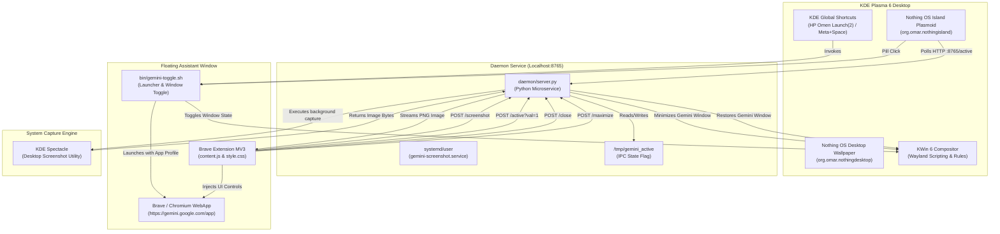

# Gemini Floating Assistant & Nothing OS Island Suite
### Enterprise Desktop Customization Suite for KDE Plasma 6 (Wayland)

[](https://kde.org/plasma-desktop/)
[]()
[]()
[]()

A production-grade, modular Linux desktop enhancement suite that bridges the mobile Android Gemini assistant floating overlay experience with the refined aesthetic of the Nothing OS Dynamic Island topbar on KDE Plasma 6 Wayland.

---

## Architecture Overview

The suite coordinates five modular subsystems across user space, compositor D-Bus APIs, systemd user services, and browser extensions to achieve seamless floating AI assistance.

### Mermaid Architecture Diagram



### ASCII Subsystem Layout

```
+-----------------------------------------------------------------------------+
|                            NOTHING OS DYNAMIC ISLAND                        |
|  [ Clock ]  [ Media Controls ]  [ System Vitals ]  [ Electric Blue Wave ]   |
+-----------------------------------------------------------------------------+
                                       | HTTP Polling (300ms)
                                       v
                     +-----------------------------------+
                     |       DAEMON (server.py:8765)     |
                     |  - State tracking: /tmp/gemini... |
                     |  - Window hide / restore (KWin)   |
                     |  - Desktop capture (Spectacle)    |
                     +-----------------------------------+
                       ^            |                ^
       HTTP /screenshot|            | DBus /Scripting| HTTP /active
                       |            v                |
+------------------------------+  +--------------------+
|   BRAVE EXTENSION (MV3)      |  |  KWIN 6 COMPOSITOR |
|  - "Attach Screen" Action    |  |  - Overlay Rules   |
|  - 3-Tier Image Injection    |  |  - Geometry:       |
|  - Glassmorphic Max / Close  |  |    410x710 @ (R,B) |
+------------------------------+  +--------------------+
               ^                            ^
               | Launches WebApp            | Toggles Window
+------------------------------------------------------+
|                 bin/gemini-toggle.sh                 |
|  Shortcuts: HP Omen Key [Launch (2)] or [Meta+Space] |
+------------------------------------------------------+
```

---

## Subsystem Deep Dive

### 1. Plasmoid: Nothing OS Island (`plasmoid/org.omar.nothingisland`)
A complete declarative desktop topbar applet for KDE Plasma 6:
- **Electric Blue Wave Engine**: When the Gemini Assistant is active, an integrated HTML5/QML Canvas renders a high-performance sinusoidal wave (`#4DA3FF`) oscillating at 40 FPS (~25ms interval) with subtle opacity gradients.
- **Dynamic Status Polling**: Continuously queries `http://127.0.0.1:8765/active` every 300ms using asynchronous `XMLHttpRequest` without stalling compositor render threads.
- **Pill Launch Trigger**: Clicking the Nothing OS pill button queries `gemini-toggle.sh` via dynamic executable resolution (`StandardPaths.findExecutable` with fallback to `$HOME/.local/bin/gemini-toggle.sh`), stripping any `file://` protocol wrappers before invoking `Exec.run`.

### 2. Wallpaper Plugin: Nothing OS Desktop (`wallpaper/org.omar.nothingdesktop`)
A native KDE Plasma 6 Wallpaper plugin (`Plasma/Wallpaper`) hosting live desktop widgets behind desktop icons:
- **Nothing OS Visual Language**: Dark canvas (`#050505`) with configurable dot-matrix grid pitch, Electric Blue accents, and NDot-47 typography.
- **Independent Modular Widgets**:
  - *Dot-Matrix Clock & Date*: Large time display with animated pulsing seconds indicator.
  - *System Vitals Card*: Real-time CPU load, memory utilization, battery status, and multi-vendor GPU temperature detection.
  - *MPRIS Media Card*: Live album art display, metadata (track, artist), and interactive D-Bus playback controls.
  - *Agenda & Calendar*: Chronological event overview with local `.ics` file support.
  - *Quick Notes Scratchpad*: Editable on-screen notes widget with persistent auto-saving.
  - *Assistant Wave Widget*: 40 FPS ambient sinusoidal wave mirroring assistant activity on the desktop surface.
- **Native Configuration Surface**: Full Qt/Kirigami settings interface accessible via Plasma's "Desktop and Wallpaper" dialog for toggling widgets, positioning them across 7 layout anchors, and tweaking accent colors.

### 3. Brave Extension (`extension/`)
Manifest V3 browser extension tailored specifically for `https://gemini.google.com/*`:
- **Screen Attacher Action Pill**: Injects a floating `#gemini-screen-pill-btn` into the Gemini web client's bottom toolbar.
- **3-Tier Fallback Image Injection Pipeline**:
  1. *Primary*: Dispatches simulated file drop events to hidden native file inputs (`input[type="file"]`).
  2. *Secondary*: Creates synthetic `DragEvent` payloads (`dragenter`, `dragover`, `drop`) on the chat input surface.
  3. *Tertiary*: Dispatches synthetic `ClipboardEvent` paste actions containing standard PNG blob payloads.
- **Borderless Window Controls**: Implements minimal glassmorphic controls (`#gemini-maximize-btn`, `#gemini-close-btn`) with blurred backdrop filters and global `Escape` key dismissal.
- **Real-Time Visibility IPC**: Notifies daemon of window focus, blur, and tab visibility transitions via `/active?val=1` and `/active?val=0`.

### 4. Daemon Microservice (`daemon/server.py`)
A lightweight, dependency-free Python 3 server bound strictly to `127.0.0.1:8765`:
- **Dual Communication Architecture**: Coordinates HTTP REST operations alongside an instant Unix domain socket push server (`/tmp/gemini_assistant.sock`) that broadcasts active-state changes to subscribers without polling overhead.
- **Clean Subprocess Coordination**: Invokes KDE Spectacle in headless background mode (`spectacle -b -n -o <path>`).
- **Compositor Window Masking**: Automatically runs dynamic KWin scripts to minimize the Gemini overlay prior to screen capture, preventing the assistant from blocking the captured desktop content, and immediately restores and refocuses the window upon completion.
- **Process Lifecycle Watchdog**: Background thread polls `pgrep` for active Brave instances matching the isolated user data directory and automatically clears `/tmp/gemini_active` if terminated.
- **Systemd Integration**: Provided with standard dynamic user unit definitions (`gemini-screenshot.service` and `gemini-assistant.service`) utilizing `%h` path specifiers.

### 5. Notification Daemon (`daemon/notifications/`)
A standalone `org.freedesktop.Notifications` D-Bus notification server:
- **Nothing OS Visual Language**: Dark borderless container (`#0B0B0BE6`), Electric Blue and Red urgency stripes, Space Grotesk labels, and NDot timestamps.
- **Per-App Rules & Scheduling**: Configurable via `~/.config/nothing-desktop/notifications.json` with customizable urgency overrides, timeouts, custom accents, and DND quiet hours.
- **Persistent History Storage**: SQLite database store (`~/.local/share/nothing-desktop/notifications.db`) capturing recent notifications for the topbar bell dropdown.
- **Reversible Plasma Suppression**: Non-destructive popup redirection via `plasmanotifyrc` backup and restoration.

### 6. Spotlight Command Palette & Unified Settings (`palette/`, `settings/`)
- **Spotlight Command Palette (`bin/nothing-palette.sh`)**: Quick launcher overlay with keyboard navigation for system commands, assistant toggles, fan modes, and apps.
- **Unified Settings Interface (`bin/nothing-settings.sh`)**: Single QML settings hub configuring Island toggles, wallpaper widgets, notifications, cooling profiles, and keyboard shortcuts.

### 7. KWin 6 Window Rules (`kwin/gemini-kwinrules.conf`)
Dedicated compositor window rule ensuring true mobile-style floating overlay behavior:
- Target window class: `brave-gemini.google.com__app-Default`.
- Enforces forced override rules (`rule=3`) for:
  - Keep Above (`above=true`, `aboverule=3`)
  - No Titlebar or Borders (`noborder=true`, `noborderrule=3`)
  - Exclude from Taskbar (`skiptaskbar=true`, `skiptaskbarrule=3`)
  - Exclude from Window Switcher (`skipswitcher=true`, `skipswitcherrule=3`)
  - Fixed Compact Geometry: Width 410px, Height 710px, positioned at bottom-right of primary display (`1490, 330` on 1080p).

### 8. Shortcuts & Launcher (`bin/gemini-toggle.sh`, `desktop/`)
- **Toggle Script**: Interrogates KWin workspace clients via D-Bus; if Gemini is open, it minimizes or restores the window instantly. If closed, it spawns Brave with an isolated web application profile (`--user-data-dir=$XDG_DATA_HOME/gemini-assistant/brave-profile`) and loads the unpacked extension (`--load-extension=$XDG_DATA_HOME/gemini-assistant/extension`).
- **Desktop Entry**: XDG compliant entry registering dedicated hardware accelerators:
  - HP Omen Dedicated AI key: `Launch (2)`
  - Auxiliary laptop function keys: `Launch (1)`, `Launch (C)`
  - Standard desktop modifier combination: `Meta+Space`

---

## Installation Guide

The suite includes an idempotent, non-destructive installer that dynamically resolves all target paths using standard XDG environment variables.

### Prerequisites

Ensure the following packages are installed on your Linux distribution:
- **KDE Plasma 6** desktop environment running Wayland.
- **Python 3.10+** (standard library only; no pip dependencies required).
- **Brave Browser** (or Google Chrome / Chromium).
- **KDE Spectacle** (`spectacle`) for desktop screenshots.
- **Qt 6 & Plasma Build Tools** (`qdbus6`, `kwriteconfig6`, `kbuildsycoca6`, `kpackagetool6`).

### 1. Environment Health Check
Before installation, verify your system meets all dependency requirements:

```bash
./install.sh --check
```

### 2. Dry-Run Simulation
Preview planned directory structures, file copies, systemd services, and KWin rules without touching your system:

```bash
./install.sh --dry-run
```

### 3. Complete Installation
Deploy the suite into your user environment:

```bash
./install.sh
```

During installation, the script:
1. Deploys the Plasmoid to `~/.local/share/plasma/plasmoids/org.omar.nothingisland`.
2. Deploys extension assets and daemon to `~/.local/share/gemini-assistant/`.
3. Installs `gemini-toggle.sh` to `~/.local/bin/` and verifies execution permissions.
4. Registers `gemini-overlay.desktop` in `~/.local/share/applications/`.
5. Installs user systemd unit files to `~/.config/systemd/user/`.
6. Safely merges the KWin 6 window rule into `~/.config/kwinrulesrc` without corrupting existing rules and reloads KWin via DBus.
7. Registers global shortcuts and refreshes the KDE sycoca cache.
8. Reloads systemd user daemon and enables `gemini-screenshot.service`.

---

## Keyboard Shortcuts & Hardware Mapping Guide

The assistant is configured to launch or toggle visibility via both dedicated hardware keys and standard key combos:

| Shortcut | Target Hardware / Platform | Action |
|:---|:---|:---|
| `Launch (2)` | **HP Omen Dedicated Key** (Diamond / Omen logo) | Toggle overlay minimize / restore |
| `Meta + Space` | Standard universal Linux keyboard combo | Toggle overlay minimize / restore |
| `Launch (1)` | Secondary vendor function key | Fallback toggle trigger |
| `Escape` | In-window global listener | Minimize overlay and reset active state |

### Manual Shortcut Configuration in KDE Plasma 6
If your keyboard layout requires custom key assignment:
1. Open **System Settings** -> **Shortcuts** -> **Custom Shortcuts** (or **Command Shortcuts**).
2. Select **Gemini**.
3. Reassign the shortcut trigger to your preferred key binding.
4. Apply changes; KDE will persist the binding in `~/.config/kglobalshortcutsrc`.

---

## Uninstallation Guide

The suite provides a clean, comprehensive uninstaller that removes all deployed files, stops background systemd units, removes KWin rules, and restores system configuration.

### Dry-Run Simulation

```bash
./uninstall.sh --dry-run
```

### Complete Uninstallation

```bash
./uninstall.sh
```

The uninstaller:
- Stops and disables `gemini-screenshot.service` and `gemini-assistant.service`.
- Deletes `~/.local/share/plasma/plasmoids/org.omar.nothingisland`.
- Deletes `~/.local/share/gemini-assistant/`.
- Deletes `~/.local/bin/gemini-toggle.sh`.
- Deletes `~/.local/share/applications/gemini-overlay.desktop`.
- Strips the Gemini window rule from `~/.config/kwinrulesrc` and signals KWin to reconfigure.
- Rebuilds the KDE system configuration cache (`kbuildsycoca6`).

---

## Troubleshooting on KDE Plasma 6 (Wayland)

### 1. Window Appears as Standard Browser Tab Instead of Borderless Overlay
- **Cause**: KWin rules have not yet reloaded or window class mismatch.
- **Remedy**: Force KWin to re-read its rules via D-Bus:
  ```bash
  qdbus6 org.kde.KWin /KWin org.kde.KWin.reconfigure
  ```
  Verify that the rule is present in `~/.config/kwinrulesrc` under `wmclass=brave-gemini.google.com__app-Default`.

### 2. Clicking "Attach Screen" Reports Screenshot Error or HTTP 503
- **Cause**: Spectacle is not installed or daemon is not running.
- **Remedy**:
  - Verify Spectacle binary is available: `which spectacle`
  - Check daemon service status:
    ```bash
    systemctl --user status gemini-screenshot.service
    ```
  - Test daemon screenshot capture manually:
    ```bash
    curl -I http://127.0.0.1:8765/screenshot
    ```

### 3. Nothing Island Plasmoid Missing from Plasma Widget Explorer
- **Cause**: Plasma applet cache has not refreshed after installation.
- **Remedy**: Re-register the applet with `kpackagetool6`:
  ```bash
  kpackagetool6 --type Plasma/Applet --install ~/.local/share/plasma/plasmoids/org.omar.nothingisland
  # Or if already installed:
  kpackagetool6 --type Plasma/Applet --upgrade ~/.local/share/plasma/plasmoids/org.omar.nothingisland
  ```

### 4. Extension Fails to Attach Screenshots into Prompt
- **Cause**: Gemini web application DOM elements changed or file input selector updated.
- **Remedy**: The extension incorporates a 3-tier fallback (native file input -> drag event simulation -> synthetic clipboard paste). Ensure Brave has granted the extension permissions on `https://gemini.google.com/*`. Open Brave Developer Tools (`F12`) on the Gemini window to inspect console logs prefixed with `[GeminiOverlay]`.

---

## Automated Verification & Test Suite

The repository contains an enterprise 4-tier automated test harness covering all 22 project features:

```bash
# Execute comprehensive E2E test suite across all 4 tiers:
bash tests/e2e_test_runner.sh

# Run individual test tiers:
bash tests/e2e_test_runner.sh --tier 1  # Specification & Syntax Verification
bash tests/e2e_test_runner.sh --tier 2  # Boundary Cases & Zero-Hardcode Path Audit
bash tests/e2e_test_runner.sh --tier 3  # Cross-Feature & Pairwise REST/DBus Contracts
bash tests/e2e_test_runner.sh --tier 4  # Real-World Deployment & Workflow Scenarios
```

---

## License

This project is licensed under the MIT License — see the LICENSE file for details.
